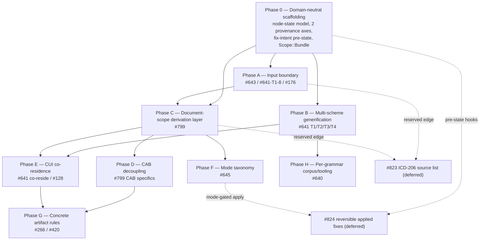

# Implementation Plan: Document-Scope Artifacts & Multi-Scheme Co-Residence

**Branch**: `007-document-scope-artifacts-multi-scheme` | **Date**: 2026-05-30 | **Spec**: [spec.md](./spec.md)
**Input**: Feature specification from `specs/007-document-scope-artifacts-multi-scheme/spec.md`

## Summary

Decouple document-scoped artifacts (CAB, `Declassify On`, notices, caveats) from the marking
pivot type and model them as typed nodes in a static derivation DAG with a four-state node model
(`Present | AbsentButRequired | AbsentNotRequired | PresentNonCanonical`); add a document-scope
aggregate (`DocumentContext`) analogous to `PageContext`; and land the domain-neutral
infrastructure for two grammars to co-reside on one document (scheme-set container, two-scope
cross-scheme reconciliation, `Product`+monotone-closure releasability per the lattice-consultant
verdict in `research.md`). Sequenced as a phased program honoring the Constitution's
feature-development order. #823 and #824 are deferred — this feature reserves their seams
(`Scope::Bundle`, fix-intent pre-state fields).

## Technical Context

**Language/Version**: Rust 1.85+ (edition 2024).
**Primary Dependencies**: existing workspace deps only (memchr, aho-corasick, smallvec, blake3,
serde, tokio/axum at the engine/server boundary). No new runtime deps; no copyleft (Constitution
Tech Stack / `deny.toml`).
**Storage**: N/A on the hot path (build-time `OUT_DIR` only).
**Testing**: `cargo test` per-crate; corpus-accuracy harness; criterion latency/throughput gates;
`audit_g13_canary` content-ignorance test.
**Target Platform**: native + WASM. The WASM-safe set (`marque-ism`, `marque-core`,
`marque-rules`, `marque-scheme`, `marque-capco`) MUST stay WASM-safe (Constitution III).
**Project Type**: Rust workspace (compiler/library + CLI + server + WASM).
**Performance Goals**: interactive p95 ≤ 16 ms (SC-001 harness); linear fix throughput (SC-005).
**Constraints**: zero-copy streaming core; audit content-ignorance (G13); acyclic crate graph.
**Scale/Scope**: a phased program across all WASM-safe crates + engine + integration surfaces;
~9 phases (0, A–H) plus two deferred groups.

## Constitution Check

*GATE: must pass before Phase 0 research and re-checked after Phase 1 design.*

| Principle | Status | Notes |
|-----------|--------|-------|
| I. Performance | PASS (gated) | New document-scope pass reuses the cached topological order (scheduler) and the existing per-page accumulator pattern; SC-008 enforces no p95/throughput regression. |
| II. Zero-copy / lifecycle wipe | PASS | Artifact nodes hold `Span` offsets, not content copies; any new owned content buffer wipes on drop (`secrecy`/`zeroize`). Reversibility pre-state stores canonicals/digests, not free-form text. |
| III. Format-agnostic / WASM | PASS | All new types in the WASM-safe set are I/O-free. `InputAdapter` is a trait in `marque-scheme`; concrete schema-reading adapters live in non-WASM crates. WASM runtime-config restriction honored: no new recognizer codepath loadable at runtime. |
| IV. Two-layer rule arch | PASS | Node detection/derivation declared as data (`Constraint`/`PageRewrite`-style catalog + derivation edges); §C.4/§C.5 strings are Layer-2 rules citing the manual. |
| V. Audit-first | PASS | Derivations recorded via the content-ignorant `DecisionSink` cascade; reversibility pre-state uses only audit-permitted terms (token canonicals, category IDs, spans, BLAKE3). `__engine_promote` stays engine-only. |
| VI. Dataflow pipeline | PASS | Document-scope is a new roll-up layer above page roll-up, not a collapsed function; reset-before-parse invariant extended to document boundaries; rules/recognizers stay `Send + Sync`, no global mutable state. |
| VII. Crate discipline | PASS | `marque-scheme` stays the leaf (no `marque-ism` dep); cross-scheme reconciliation lands in `marque-engine` (model b). New CUI grammar (later) sits **alongside** `marque-ism` as a peer. |
| VIII. Source fidelity | PASS | §C.4/§C.5/§H.7/§H.8 citations verified against `crates/capco/docs/CAPCO-2016.md`; CUI claims flagged source-pending. |

**Gate decision**: PASS. One sequencing rule from Principle IV is load-bearing: *a
scheme-adoption PR MUST NOT edit the engine crates*. Therefore the domain-neutral infrastructure
(Phases 0/A/B/C/D/F) lands **before** any scheme adoption (CUI), and the CUI co-residence work
(Phase E) is gated on those engine seams existing. No Complexity-Tracking violations.

## Project Structure

### Documentation (this feature)

```text
specs/007-document-scope-artifacts-multi-scheme/
├── plan.md              # This file
├── spec.md              # Prioritized user stories, FRs, success criteria
├── research.md          # Resolved design decisions (memo "Open items" + #641 tiers + lattice verdict)
├── data-model.md        # Every new/changed type, by crate and phase
├── contracts/
│   ├── document-artifact.md   # node trait + state machine + DocumentContext
│   ├── input-adapter.md       # InputAdapter / StructuredDocument / RepairKind / InputSource
│   ├── multi-scheme.md        # scheme-set container / Translate / CoherenceRule
│   └── reversibility.md       # fix-intent inverse-record surface (#824 rough-in)
└── tasks.md             # Dependency-ordered tasks grouped by phase
```

### Source Code (repository root — touched crates)

```text
crates/
├── scheme/      # Phase 0/A/B(T3)/E primitives: ArtifactState, DocumentArtifact, DerivationEdge,
│                #   Scope::Bundle, InputSource/InputContext/InputAdapter, RecognitionProvenance,
│                #   ValueDerivation, Translate/CoherenceRule, T3 renames. LEAF — no marque-ism dep.
├── rules/       # Phase B: Rule<S> generification (T1-1/T1-2), MessageTemplate/FeatureId
│                #   #[non_exhaustive] + Grammar escape (T2), fix-intent pre-state fields (#824).
├── ism/         # Phase D: CAB node off CanonicalAttrs; DocumentContext shape; declassify-on node.
├── core/        # Phase D/G: parse_cab → artifact-node producer; absence-detect recognizers (#420).
├── capco/       # Phase D/E/G: CapcoScheme artifact/edge declarations; §C.4/§C.5 rules; co-residence.
├── engine/      # Phase B/C/E/F: Engine<S>, MultiGrammarEngine, DocumentContext accumulator,
│                #   derivation scheduler extension, EngineConfig mode fields, reconciliation (model b).
├── config/      # Phase F: severity_cap, fix_zones, deployment, grammar_schema (#641 T4-1).
└── (cui/)       # FUTURE peer crate — out of scope here; only the seams it needs are landed.
tools/ + tests/corpus/   # Phase H: per-grammar corpus/priors/harness (#640).
```

**Structure Decision**: changes follow the existing crate graph exactly; no new crate lands in
this feature (the `marque-cui` peer is future work). The phase ordering below maps onto the
Constitution's feature-development sequence (scheme/rules/ism → core → capco → engine →
integration surfaces).

## Phased Roadmap

Each phase is independently land-able as one or more PRs. Build order:




| Phase | Scope | Issues | Crates | Gates on |
|-------|-------|--------|--------|----------|
| **0** | Domain-neutral scaffolding: `ArtifactState`, `DocumentArtifact`, `DerivationEdge`, `Scope::Bundle`, two provenance axes, fix-intent pre-state fields | memo "must honor now"; #824/#823 rough-in | scheme, rules | — |
| **A** | Input boundary: `InputAdapter`, `StructuredDocument`/`DocumentLayer`/`RepairKind`, promote `InputSource` + `InputContext`, #176 confidence calibration | #643, #641 T1-8, #176 | scheme, engine | 0 |
| **B** | Multi-scheme generification: `Rule<S>::check(&S::Canonical,…)`, `RuleContext<S>`, `Engine<S>`, scheme-set container, T2 `#[non_exhaustive]`+`Grammar` escapes, T3 renames, T4 config/entry wiring | #641 T1/T2/T3/T4 | rules, engine, config, capco, wasm, server, cli | 0 |
| **C** | Document-scope derivation layer: `DocumentContext`, derivation DAG (extend scheduler), absence-as-state, cascade-recorded derivations, reverse validation, "classified up to" front marking | #799 | scheme, engine | 0, A |
| **D** | CAB decoupling: CAB off `CanonicalAttrs` → `DocumentArtifact`; CAB normalizer/serializer (forward-evaluable); original-vs-derivative as two inbound edges; declassify-on node w/ multiple provenances | #799, memo CAB specifics | ism, core, capco, engine | C |
| **E** | CUI co-residence: two-scope reconciliation, `Product`+monotone NOFORN closure, relocate-not-evict, `(S//CUI)` conflict, #128 ≡ LDC value set | #641 co-reside, #128 | engine, capco | B, C |
| **F** | Mode taxonomy: `severity_cap`, `fix_zones`/`target_zones`, `DeploymentContext`, `as_of` wiring, `ArchivalIntent`, `GrammarEra` | #645 (M4/M5 dep #206) | config, scheme, engine | C |
| **G** | Concrete artifact rules: §C.4/§C.5 canned `Declassify On` strings; missing portion-mark/banner detection | #266, #420 | core, capco | D, E |
| **H** | Per-grammar corpus/tooling: directory namespace, `analyze.py` profile, per-grammar priors, harness | #640 | tools, tests, capco build | B |
| **Deferred** | #823 ICD-206 source-list generation (gated on A + C reserved edge); #824 reversible-applied-fixes realization (audit-schema bump; uses 0's pre-state fields + F's mode gating) | #823, #824 | — | A, C / 0, F |

### Phase detail pointers

- **Phase 0** is the blocking foundation and the only phase that *must* land before everything
  else; it is pure additive type-surface in the WASM-safe leaf crates, testable in isolation.
- **Phases A and B fan out** from 0 and can proceed in parallel (different crates/seams).
- **Phase C → D** (derivation layer must exist before CAB becomes a node consuming it) and
  **B,C → E** (co-residence needs both the generic engine and the document-scope layer).
- **#823/#824 stay deferred** but their seams are landed in Phase 0 (pre-state fields,
  `Scope::Bundle`) so adding them later is additive, not a breaking change.

## Complexity Tracking

No Constitution violations requiring justification. The one structural risk — adding a
document-scope pass without regressing latency — is mitigated by reusing the cached topological
scheduler order and the existing per-page accumulator pattern, and is gated by SC-008.
